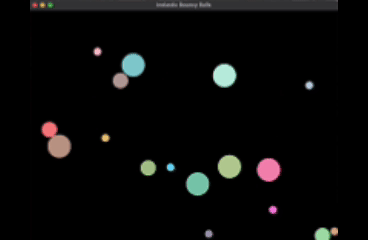

# physicSims

Just a collection of 2D physics simulations that I wanted to explore (and that my M2 can handle).
Use "make && make run" in the terminal to see some cool things!

Currently have:
- Inelastic simulator with many balls

